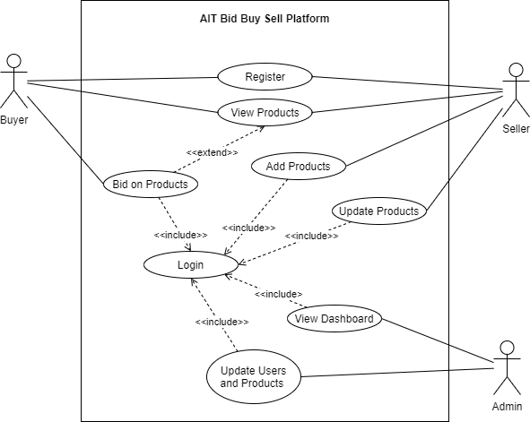

># _This is considered the first official phase of the SAD project._

#### _**Use Case Diagram**_

## Deliverables:

1. **UI Mockups** 
   - explaining applications using mockups. These mockups is use-case based, i.e., one series of mockups for one use case. 

2. **Requirements** 
   - explaining project requirements in details. Document the (1)stakeholders, (2) must-have vs. good to have requirements, (3) project timeline, (4) risk and mitigation plan, (5) initial architecture - some initial class and sequence diagrams, deployment diagrams, external parties in UML format.

