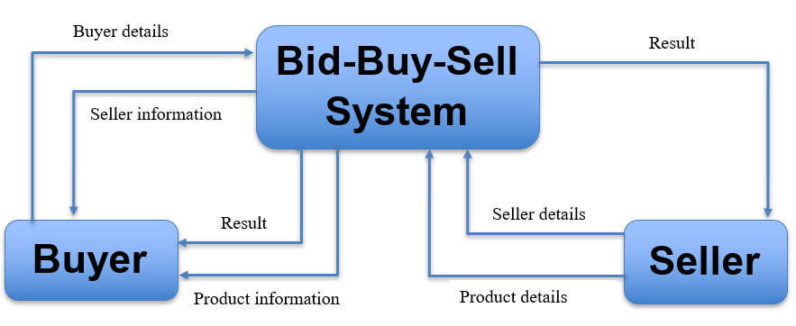
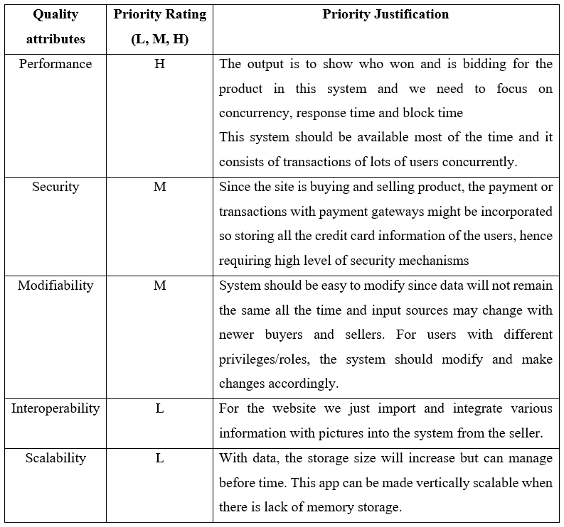

># Bid-Buy-Sell-Project
## Software Architecture Design Project 2021

#### _**Team Member:**_
1. Shubhangini Gontia (Leader)
2. Suyogya Ratna Tamrakar
3. Younten Tshering

#### _**Project Topic:**_
>_“E-commerce website to sell second hand product; Bidding system for AIT.”_

It's idea is like any e-commerce platform in which buying and selling of goods are done. But the core addition will be the system of bidding before buying anything.The products added will be subjected to certain time frame where users most probably buyers will be allowed to bid on their products and are able to buy the product once the bid time closes or when there are no other bidders. 
In case of AIT, this platform can be used to sell the used items. More than one person could be interested in the same product, but with this system, there will be a sense of competition as one person bids over another user’s bid at the same time and the product value will also increase.

#### _**Context Diagram**_

#### _**Architecture:**_
Will update soon

#### _**Implementation details:**_
Will update soon

#### _**Quality attribute analysis:**_

#### _**Responsibility of team member and modules**_
As of now, we have identified the major Task or modules as follows:
1. **User modules**
Post information and update the details.

2.  **DB modules**
Bid the price of product and view the increasing price in the event time.

3. **Admin modules**
Security of the bidding system and keeping track of the seller and buyer with profit.

>Team member will be splitting the modules as per the architectural patterns implementation and since all the members are in campus, we are planning to work together.

#### _**Meeting schedule**_
* Every Wednesday – 8:00 PM to 10:30 PM  
  - Progress and issues meeting
* Every Sunday – 6:00 PM to 10:30 PM  
  - Pair programming
